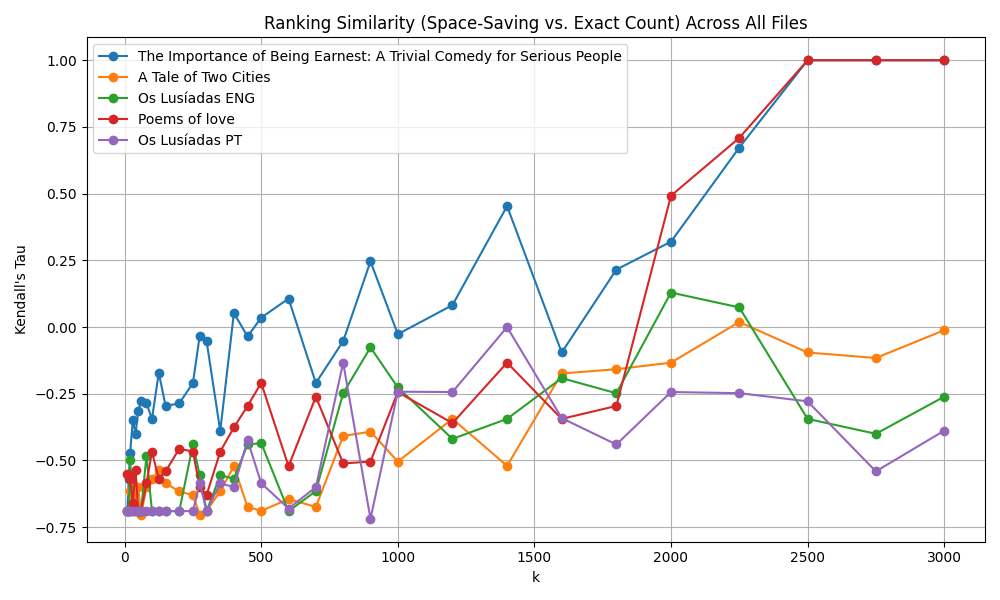

# Most Frequent and Less Frequent Words

Analyzing word frequencies within extensive text collections is a fundamental task in natural language processing, yet it poses significant challenges due to the vast number of unique words and the computational resources required. Traditional **Exact Count** methods, while precise, become impractical as dataset sizes scale, necessitating the exploration of more memory-efficient alternatives. This study investigates two such approximate algorithms: **Fixed Probability Sampling** and the **Space Saving** method [@10.14778/3514061.3514068; @Top_Elements_Data_Streams]. The Exact Count method serves as the baseline, providing accurate frequency counts by maintaining a count for every unique word. In contrast, Fixed Probability Sampling offers an unbiased estimation of word counts by randomly sampling occurrences with a predefined probability \( p \), whereas the Space Saving method maintains a fixed number of word-count pairs, prioritizing the most frequent words and dynamically evicting less frequent ones as new words are encountered. We conducted computational experiments on a diverse set of text files obtained from [@gutenberg], encompassing different languages and varying sizes. Performance metrics assessed include runtime, memory usage, and accuracy, evaluated through precision measures and [@wiki:kendall] (\(\tau\)). The results demonstrate that while the Exact Count method provides unparalleled accuracy, it suffers from high memory consumption, making it unsuitable for large-scale applications. Fixed Probability Sampling effectively identifies the most frequent words with high precision but struggles with less frequent words due to high variance when \( p \) is small. Conversely, the Space Saving method offers a balanced trade-off between memory efficiency and ranking accuracy, particularly excelling when the parameter \( k \) is optimally set around 2250. These findings offer valuable insights into selecting appropriate word counting strategies based on specific application requirements, balancing the need for computational efficiency with the demand for accurate frequency estimations.

---

## Problem Definition

Identify the most frequent words in large text collections efficiently. A straightforward approach is to store a count for each unique word, but this can be infeasible when the data is very large. Therefore, it is a must to explore alternative methods that use less memory and still provide good estimates of word frequencies.

---

## Algorithms Description

### Exact Count

1. **Initialization**:
   1. Creating a new *Counter* with an iterable (e.g., a list of words) internally builds a dictionary that maps each unique element \( w \) to an integer count based on how many times \( w \) appears in the input.
   2. For example, if the iterable contains elements \(\{w_1, w_1, w_2, w_3\}\), then the internal structure becomes \(\{w_1 : 2, w_2 : 1, w_3 : 1\}\).

2. **Incrementing Counts**:
   1. When processing a new element \( x \) via
      \[
      \texttt{counter[x] += 1},
      \]
      the **Counter** checks if \( x \) is already a key in its dictionary.
   2. If not, it initializes \(\text{counter}[x] = 0\) before incrementing, so every newly encountered item is seamlessly added with the appropriate count.

3. **Retrieving Counts and Most Common Elements**:
   1. Accessing the current count \(\texttt{counter[x]}\) simply looks up the value of \( x \) in the internal dictionary. If \( x \) is absent, a default of 0 is returned.
   2. The method
      \[
      \texttt{word\_counter.most\_common(k)}
      \]
      performs an internal sort (or partial sort) of the dictionary items by their counts in descending order, returning the top \( k \) most frequent elements as \((\textit{element}, \textit{count})\) pairs.

**Key Points**:
- The *Counter* is a dictionary data structure specialized for counting hashable objects.
- It handles initialization and increments so that unseen keys default to a count of 0.
- Although extremely convenient for storing exact counts, it may consume large amounts of memory if the text collection is massive.

### Fixed Probability Count

1. **Initialize the algorithm**:
   1. Set the probability parameter \( p \) (\( p = \frac{1}{32} \)).
   2. Create an empty map (dictionary) \( \text{counter} = \emptyset \) that stores \((\text{item} \mapsto \text{count})\).

2. **Process each incoming item \( x \)**:
   1. Generate a random number \( r \) in the range \([0,\,1)\).
   2. If \( r < p \):
      1. Increment \( \text{counter}[x] \) by 1. (If \( x \) is not yet in \( \text{counter} \), initialize \( \text{counter}[x] = 0 \) before incrementing.)
   3. Otherwise, do nothing for this item (i.e., no increment).

3. **Frequency Estimation**:
   1. For an item \( x \), the estimated count is given by:
      \[
      \widehat{f}(x) = \text{counter}[x] \times \biggl\lfloor \tfrac{1}{p} \biggr\rfloor.
      \]
   2. For simplicity, we use \(\lfloor \tfrac{1}{p} \rfloor\) in the implementation, but in theory multiplying by \(\tfrac{1}{p}\) directly yields an unbiased estimator of the true frequency.

**Key Points**:
- Each incoming item \( x \) has a probability \( p \) of being *sampled* (incremented).
- After processing the entire stream, the *estimated frequency* of \( x \) is scaled up by \(\tfrac{1}{p}\) to approximate its true count.
- The method is *unbiased* in expectation, but it can exhibit high [@wiki:variance] if \( p \) is small.
- *Note: A graphic could be used here to explain this concept.*

#### Proof of Unbiasedness and Variance Properties

##### Unbiasedness in Expectation

**Statement**: The estimator \( \hat{C} \) is unbiased, i.e., \( \mathbb{E}[\hat{C}] = C \), where \( C \) is the true count of a word.

**Proof**:

Let \( C \) denote the true count of a specific word in the text. The Fixed Probability Sampling method involves including each occurrence of the word in the sample with probability \( p \).

Define the random variable \( X_i \) for the \( i^{\text{th}} \) occurrence of the word as:

\[
X_i =
\begin{cases}
1 & \text{if the } i^{\text{th}} \text{ occurrence is sampled}, \\
0 & \text{otherwise}.
\end{cases}
\]

Since each occurrence is included independently with probability \( p \), \( X_i \) follows a [@wiki:bernoulli] distribution:

\[
X_i \sim \text{Bernoulli}(p)
\]

The estimator \( \hat{C} \) for the true count \( C \) is given by:

\[
\hat{C} = \frac{1}{p} \sum_{i=1}^{C} X_i
\]

To find the expectation of \( \hat{C} \):

\[
\mathbb{E}[\hat{C}] = \mathbb{E}\left[ \frac{1}{p} \sum_{i=1}^{C} X_i \right] = \frac{1}{p} \sum_{i=1}^{C} \mathbb{E}[X_i]
\]

Since \( \mathbb{E}[X_i] = p \):

\[
\mathbb{E}[\hat{C}] = \frac{1}{p} \cdot C \cdot p = C
\]

**Conclusion**: The estimator \( \hat{C} \) is unbiased because its expectation equals the true count \( C \).

##### Variance of the Estimator

**Statement**: The estimator \( \hat{C} \) can exhibit high variance if \( p \) is small.

**Proof**:

Continuing from the previous definitions, the estimator is:

\[
\hat{C} = \frac{1}{p} \sum_{i=1}^{C} X_i
\]

First, compute the variance of \( \hat{C} \):

\[
\text{Var}(\hat{C}) = \text{Var}\left( \frac{1}{p} \sum_{i=1}^{C} X_i \right) = \frac{1}{p^2} \text{Var}\left( \sum_{i=1}^{C} X_i \right)
\]

Since the \( X_i \) are independent:

\[
\text{Var}\left( \sum_{i=1}^{C} X_i \right) = \sum_{i=1}^{C} \text{Var}(X_i)
\]

For a Bernoulli random variable \( X_i \):

\[
\text{Var}(X_i) = p(1 - p)
\]

Thus:

\[
\text{Var}(\hat{C}) = \frac{C(1 - p)}{p}
\]

**Analysis**:

As \( p \) decreases (i.e., becomes smaller), the denominator \( p \) in the variance expression \( \frac{C(1 - p)}{p} \) becomes smaller, leading to an increase in variance. Specifically, for very small \( p \), the variance \( \text{Var}(\hat{C}) \) approaches \( \frac{C}{p} \), which can be significantly large.

**Conclusion**: The variance of the estimator \( \hat{C} \) increases as the sampling probability \( p \) decreases. Therefore, when \( p \) is small, the estimator can exhibit high variance, making the estimates less reliable despite being unbiased.

##### Summary

- **Unbiasedness**: The *Fixed Probability Sampling* method provides an unbiased estimator for the true word count, as the expected value of the estimator equals the actual count.
- **Variance**: The estimator's variance is inversely proportional to the sampling probability \( p \). Smaller values of \( p \) lead to higher variance, which can result in less reliable estimates due to increased fluctuations around the true count.

##### Implications

When applying the *Fixed Probability Sampling* method:
- **Choice of \( p \)**: Selecting an appropriate \( p \) is crucial. While smaller \( p \) values conserve computational resources by sampling fewer words, they introduce higher variance, potentially compromising the estimator's reliability.
- **Balancing Act**: A balance must be struck between computational efficiency and estimator reliability. Depending on the application's tolerance for variance, \( p \) should be chosen to minimize computational overhead without excessively increasing variance.

### Space Saving

1. **Initialize the algorithm**:
   1. Set the maximum capacity \( k \).
   2. Create an empty map (dictionary) \( \text{counter} = \emptyset \), which stores \((\text{item} \mapsto \text{count})\).
   3. Create a min-heap \( H \) for the pairs \((\text{count}, \text{item})\).

2. **Process each incoming item \( x \) in the data stream**:
   1. **Case 1:** If \( x \) is already in \( \text{counter} \):
      1. Increment its count: \( \text{counter}[x] = \text{counter}[x] + 1 \).
      2. Update the corresponding pair \((\text{count}, x)\) in the min-heap \( H \).
   2. **Case 2:** If \( x \) is *not* in \( \text{counter} \) and \( |\text{counter}| < k \):
      1. Set \( \text{counter}[x] = 1 \).
      2. Insert \((1, x)\) into the min-heap \( H \).
   3. **Case 3:** If \( x \) is *not* in \( \text{counter} \) and \( |\text{counter}| = k \):
      1. Extract the smallest pair \((\min\_count, \min\_item)\) from \( H \). (This corresponds to the item with the lowest approximate count so far.)
      2. Remove \( \min\_item \) from \( \text{counter} \).
      3. Insert \( x \) in \( \text{counter} \) with \( \text{counter}[x] = \min\_count + 1 \).
      4. Push \((\min\_count + 1, x)\) into \( H \).

3. **Output**:
   1. After processing the entire stream, the map \( \text{counter} \) holds the items and their approximate counts.
   2. The min-heap \( H \) can be used to quickly retrieve the most frequent items.

**Key Points**:
- The algorithm preserves a set of \( k \) items with the highest counts, approximating the *frequent* items (heavy hitters).
- Whenever a new item \( x \) arrives and the structure is full, the item with the smallest stored count is evicted, and \( x \) is inserted with that evicted count plus one.
- This strategy ensures that *truly frequent* items are unlikely to be evicted.
- If \( k \) is too small relative to the number of distinct words, the Space Saving method may behave unexpectedly when retrieving the most frequent words. For example, a \( k \) value of 100 may not be sufficiently large to accommodate all distinct words in a text with 3000 unique words. This limitation results in numerous evictions and artificially inflates the counts of words that appear more frequently towards the latter portion of the file.

---

## Text Processing

The text is first converted to lowercase so that any original capitalization is normalized. Next, a regular expression removes all characters that are not letters or whitespace, substituting them with single spaces. Another regular expression collapses multiple spaces into one, and leading or trailing whitespace is stripped. The resulting string is then split by whitespace to create a list of tokens. Each token is checked against a predefined set of stop words in English and Portuguese and is also required to have more than one character. Any token that fails either condition is discarded.

---

## Computational Experiments

In this study, the three methods referenced in the **Algorithms Description** section were evaluated on a collection of text files in different languages and of varying sizes. Each file was first subjected to a processing stage: converting all characters to lowercase, removing punctuation and stop words, and splitting the text into tokens. The properties of these files are summarized in [Table: Summary of the text files used in the experiments](#table-summary-of-the-text-files-used-in-the-experiments).

### Table: Summary of the Text Files Used in the Experiments

| **File Name**                                                                              | **Total Words** | **Unique Words** |
| --------------------------                                                               | --------------: | ---------------: |
| The Importance of Being Earnest: A Trivial Comedy for Serious People                       | 10445           | 2429             |
| A Tale of Two Cities                                                                       | 64158           | 9539             |
| Os Lus\'{\i}adas ENG                                                                       | 31052           | 5821             |
| Poems of love                                                                              | 8143            | 2684             |
| Os Lus\'{\i}adas PT                                                                        | 32632           | 8220             |

For the *Exact Counting* approach, a *Counter* stored exact frequencies, generating a baseline set of true counts for every word. The *Fixed Probability* method randomly sampled each incoming word with a preset probability, storing only a fraction of all occurrences but still producing unbiased estimations when scaled by the reciprocal of that probability. The *Space Saving* algorithm maintained only a fixed number of word-count pairs at any time, evicting the entry with the smallest count whenever a new word arrived and the structure was full.

Several performance measures were recorded for each method and file. **Execution time** was measured to assess how quickly each algorithm processed the text streams. **Memory usage** was observed to understand scalability as the amount of data increased. Finally, **accuracy** of the two approximate methods was evaluated by comparing their results with the exact counts from the baseline. Common measures included calculating the precision of the most frequent words, as well as rank-based metrics such as Kendall's \(\tau\). These experiments provided insight into the trade-offs between runtime, memory consumption, and approximation quality for each approach.

---

## Results and Discussion

In this section, we present the precision comparisons between the **Exact** and **Fixed Probability** counting methods. Additionally, we analyze the relative ordering of word frequencies as determined by the **Exact Count** and **Space Saving** methods. Performance metrics, including runtime and memory usage, are also discussed. Finally, we compare the top 10 most frequent words in the Portuguese and English versions of *Os Lusíadas*.

### Precision Comparison Between Fixed Probability Count and Exact Count

The figure below illustrates the precision of the **Fixed Probability Count** method relative to the **Exact Count** across ten independent runs through every file. Precision was evaluated for both the top 10 and bottom 10 most frequent words within each run. The **Space Saving** method was not included in this comparison as it is designed to identify the most frequent words without providing exact or approximate counts for all words.

  
*Comparison of Precision between Fixed Probability Count and Exact Count for Top and Bottom Frequent Words*  
*Precision (overlap ratio) is defined as the ratio between the count from the Exact Count method and the Fixed Probability Count method.*

As depicted in the figure, the precision for the top 10 most frequent words consistently ranged between 0.8 and 1 across all ten runs. This high precision indicates that the **Fixed Probability Count** method effectively identifies the most frequent words, closely matching the results obtained from the **Exact Count** method. Such reliability makes it a suitable choice for applications where accurately capturing the most dominant terms is crucial.

Conversely, the precision for the bottom 10 most frequent words remained nearly zero throughout all runs. This negligible precision suggests that the **Fixed Probability Count** method struggles to accurately identify less frequent words, often missing them entirely or misclassifying their frequencies. The contrast between the high precision in the top \( k \) and the near-zero precision in the bottom \( k \) highlights a significant trade-off: while the Fixed Probability method excels at capturing the most frequent items, it fails to provide reliable information about the less frequent ones.

This behavior is expected given the nature of the Fixed Probability approach, which prioritizes the storage and counting of more frequent items due to the probabilistic sampling mechanism. As a result, less frequent words receive insufficient attention, leading to their poor representation in the final count.

### Relative Ordering Comparison Between Space Saving and Exact Count

The figure below demonstrates the ranking similarity between the **Space Saving** algorithm and the **Exact Count** method across various values of \( k \) for the whole dataset. To quantify this similarity, we employed the Kendall rank correlation coefficient (\(\tau\)), which measures the ordinal association between two ranked lists.

#### Kendall Rank Correlation Coefficient

The Kendall rank correlation coefficient, denoted as \(\tau\), assesses the correspondence between two rankings by evaluating the number of concordant and discordant pairs. Specifically, it calculates the probability that the ranks of two variables are in the same order versus the probability that they are in different orders.

\[
\tau = \frac{(C - D)}{\frac{1}{2}n(n-1)}
\]

where:
- \( C \) is the number of concordant pairs.
- \( D \) is the number of discordant pairs.
- \( n \) is the total number of pairs.

The denominator represents the total number of possible pairwise comparisons between items, ensuring that the coefficient's value ranges between \(-1 \leq \tau \leq 1\). In the context of our analysis, \(\tau\) quantifies the degree of similarity between the rankings produced by the **Space Saving** and **Exact Count** methods for the most frequent words in a given text.

- **Perfect Agreement (\(\tau = 1\))**: Both methods order the words identically.
- **Perfect Disagreement (\(\tau = -1\))**: One ranking is the exact inverse of the other.
- **No Correlation (\(\tau = 0\))**: There is no correlation between the two rankings.

#### Application to Word Frequency Rankings

To evaluate the relative ordering of word frequencies, we computed the Kendall \(\tau\) coefficient between the top \( k \) lists produced by the **Exact Count** and **Space Saving** methods for various values of \( k \). The process involved:

1. **Rank Assignment**:
   - Combine the top \( k \) lists from both methods (Exact Count and Space Saving) to form a unique set of words.
   - Assign ranks to each word in both the exact and approximate top \( k \) lists. Words not present in a top \( k \) list are assigned a rank of \( k+1 \).

2. **Correlation Calculation**:
   - Generate rank lists for both Exact and Space Saving methods based on the assigned ranks.
   - Compute the Kendall \(\tau\) coefficient between these two rank lists to measure their similarity.

  
*Comparison of Relative Order between Space-Saving and Exact Count*  
*The red bullet points indicate instances where the Space Saving method assigned the same rank to words as the Exact Count method, matching in terms of order.*

As seen in the figure, for low values of \( k \), the Kendall \(\tau\) score is very low, showcasing that the Space Saving method is not retrieving the actual top \( k \) words effectively. However, as \( k \) increases, the score improves, indicating better alignment between the rankings produced by the Space Saving method and the Exact Count method. For instance, in *Poems of Love*, the Kendall \(\tau\) coefficient approaches values closer to 0.5, suggesting that approximately half of the retrieved ranks by the Space Saving method align with those from the Exact Count method (at \( k = 2000 \)). This trend indicates that while the Space Saving method may not perform optimally for very small \( k \), it becomes increasingly reliable as more frequent words are considered.

Based on this analysis, an optimal value for \( k \) in this specific context is approximately \( k = 2250 \), where the balance between ranking accuracy and computational efficiency is most favorable. This value ensures that the Space Saving method captures a substantial portion of the most frequent words across all files without incurring significant computational overhead. Furthermore, since the files *Poems of Love* and *The Importance of Being Earnest: A Trivial Comedy for Serious People* have relatively few unique words (2684 and 2429, respectively), increasing \( k \) beyond 2500 allows the Space Saving method to align the word rankings precisely with those of the Exact Count method. For the other files, which contain a significantly larger number of words, the results are not identical. However, the methods occasionally achieve a zero score or approach it closely, which is considered favorable.

### Performance Metrics: Runtime and Memory Usage

The table below summarizes the runtime and memory usage of the **Exact**, **Fixed Probability** (\( p = \frac{1}{32} \)), and **Space Saving** (\( k = 50 \)) methods across different text files. The Exact Count method consistently exhibits higher memory consumption due to the necessity of storing counts for all unique words. In contrast, the Fixed Probability and Space Saving methods demonstrate significantly reduced memory footprints, with Space Saving generally requiring the least memory. However, this efficiency comes at the cost of increased runtime, particularly noticeable in larger datasets.

#### Table: Performance Summary of Exact, Fixed Probability, and Space-Saving Methods

| **File**                                                                               | **Method**         | **Time (s)** | **Memory (KB)** |
| -------------------------------------------------------------------------------------- | ------------------ | -----------: | --------------: |
| *The Importance of Being Earnest: A Trivial Comedy for Serious People*                 | Exact              | 0.0006       | 76.26           |
|                                                                                        | Fixed Probability  | 0.0008       | 10.95           |
|                                                                                        | Space Saving       | 0.0030       | 7.25            |
| *A Tale of Two Cities*                                                                 | Exact              | 0.0038       | 304.63          |
|                                                                                        | Fixed Probability  | 0.0045       | 47.26           |
|                                                                                        | Space Saving       | 0.0532       | 10.37           |
| *Os Lus\'{\i}adas ENG*                                                                 | Exact              | 0.0017       | 304.48          |
|                                                                                        | Fixed Probability  | 0.0022       | 38.50           |
|                                                                                        | Space Saving       | 0.0226       | 10.36           |
| *Poems of love*                                                                        | Exact              | 0.0005       | 76.48           |
|                                                                                        | Fixed Probability  | 0.0006       | 10.46           |
|                                                                                        | Space Saving       | 0.0027       | 7.23            |
| *Os Lus\'{\i}adas PT*                                                                   | Exact              | 0.0018       | 304.48          |
|                                                                                        | Fixed Probability  | 0.0023       | 39.15           |
|                                                                                        | Space Saving       | 0.0243       | 10.34           |

The Fixed Probability method offers a balanced trade-off between runtime and memory usage, making it suitable for applications where moderate performance is acceptable. On the other hand, the Space Saving method is highly efficient in terms of memory but incurs a higher computational cost, especially evident in larger datasets. These performance characteristics should be considered when selecting the appropriate counting strategy based on the specific requirements of the application.

### Comparison of Top 10 Words in "Os Lusíadas" (Portuguese vs. English)

The table below provides a comparative analysis of the top 10 most frequent words identified in the Portuguese and English versions of *Os Lusíadas* using the **Exact**, **Fixed Probability** (\( p = \frac{1}{32} \)), and **Space Saving** (\( k = 100 \)) methods. The Exact Count method serves as the baseline, offering precise frequency counts for each word.

#### Table: Comparison of Top 10 Words in "Os Lusíadas" (English vs. Portuguese)

| **Method**          | **Top-10 (ENG)**                                                                                                                                               | **Top-10 (PT)**                                                                                                                                         |
| ------------------- | -------------------------------------------------------------------------------------------------------------------------------------------------------------- | ------------------------------------------------------------------------------------------------------------------------------------------------------- |
| **Exact**           | er (298)   thy (169)   ring (151)   shall (142)   rous (129)   shore (128)   whose (118)   yet (115)   heaven (98)   king (96)   | gente (230)   terra (222)   rei (204)   mar (199)   onde (177)   ria (142)   grande (138)   tanto (132)   est (128)   es (113)   |
| **Fixed Probability** | er (288)   shall (224)   every (192)   monarch (192)   brave (160)   dread (160)   let (160)   ring (160)   rous (160)   wide (160) | rei (352)   terra (320)   mar (224)   pr (192)   gente (192)   mundo (192)   aqui (192)   est (192)   tria (192)   lan (160) |
| **Space Saving**    | standard (272)   hero (271)   warlike (270)   spread (270)   holy (270)   henry (270)   new (270)   moorish (270)   lo (270)   spears (270) | vossa (287)   senhor (286)   largos (286)   vereis (286)   pera (286)   mente (286)   pres (286)   aga (286)   vaticina (286)   olhando (286) |

Looking at the results for each method, the **Exact Count** correctly identified two terms (*king* \(\rightarrow\) *rei*, *rous* \(\rightarrow\) *grande*), the **Fixed Probability** method correctly identified one term (*monarch* \(\rightarrow\) *rei*), and the **Space Saving** method also correctly identified one term (*spread* \(\rightarrow\) *largos*, *lo* \(\rightarrow\) *vereis/olhando*). It is possible that not all correct terms were captured due to translation nuances.

---

## Conclusion

This study meticulously evaluated the efficacy of three word counting algorithms—**Exact Count**, **Fixed Probability Sampling**, and the **Space Saving** method—in identifying the most and least frequent words within large text datasets. Utilizing a diverse collection of texts from [@gutenberg], our experiments underscored the strengths and limitations inherent to each method.

The *Exact Count* method remained the gold standard for accuracy, providing precise frequency counts by maintaining a comprehensive record of all unique words. However, its impractical memory consumption in large-scale applications highlights a significant limitation, rendering it unsuitable for scenarios where memory resources are constrained.

The *Fixed Probability Sampling* approach demonstrated its utility by offering an unbiased estimator for word frequencies. It reliably captured the most frequent words with high precision, making it a viable alternative for applications focused on dominant terms. Nevertheless, its performance for less frequent words was compromised, exhibiting near-zero precision due to high variance when the sampling probability \( p \) is small. This susceptibility to variance underscores the method's limitations in providing comprehensive frequency analyses beyond the top \( k \) words.

Conversely, the *Space Saving* method showcased robust memory efficiency by maintaining a fixed number of \((\textit{word}, \textit{count})\) pairs. This approach effectively identified frequent words while dynamically managing less frequent ones through strategic evictions. Our analysis revealed that setting the parameter \( k \) to approximately 2250 strikes an optimal balance between ranking accuracy and computational resource utilization. In cases where \( k \) exceeds the number of unique words, the Space Saving method aligns closely with Exact Count results.

The comparative performance metrics, runtime and memory usage, further highlighted the practical trade-offs between the methods. While *Exact Count* excels in accuracy, *Fixed Probability Sampling* and *Space Saving* offer significant reductions in memory consumption, with Space Saving generally requiring the least memory at the expense of increased computational time, especially in larger datasets.

In conclusion, the choice of word counting strategy should be informed by the specific requirements of the application. *Exact Count* is ideal for scenarios where accuracy is paramount and memory resources are ample. *Fixed Probability Sampling* serves well in applications targeting the most frequent terms with acceptable memory usage, whereas the *Space Saving* method is preferable for environments demanding a balanced approach between memory efficiency and ranking precision.
